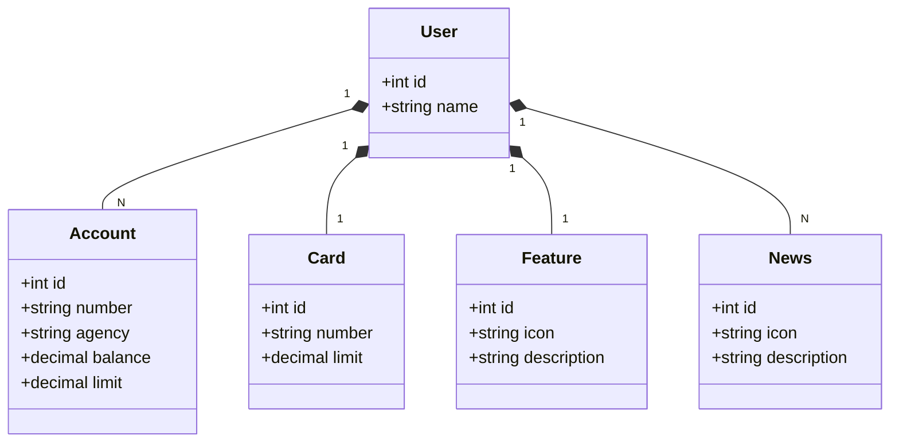

# Santander Dev Week 2023 Java API

RESTful API da Santander Dev Week 2023 construída em Java 17 com Spring Boot 3.

```mermaid
classDiagram
    class User {
        +int id
        +string name
    }

    class Account {
        +int id
        +string number
        +string agency
        +decimal balance
        +decimal limit
    }

    class Card {
        +int id
        +string number
        +decimal limit
    }

    class Feature {
        +int id
        +string icon
        +string description
    }

    class News {
        +int id
        +string icon
        +string description
    }

    User "1" *-- "N" Account
    User "1" *-- "1" Card
    User "1" *-- "1" Feature
    User "1" *-- "N" News
```
